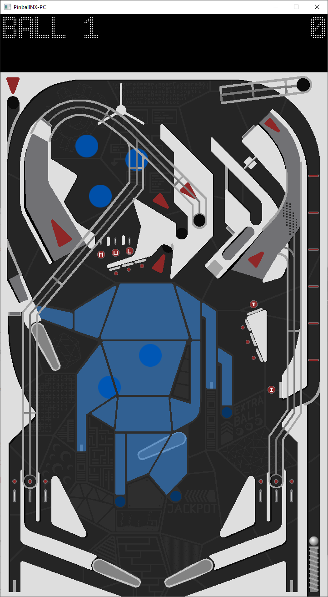

## PinballNX-PC

PinballNX is a pinball game for Windows made in C++ with SFML and Box2D. 

Controls:

Space: Start/Pause
Left, Right Shift: Flippers
Down Arrow: Plunger
Z, / : Tilt
N: New Game
M: Mute
R: Rotate Graphics
F: Enter/Exit Fullscreen
Escape: Quit

## Credits

- SFML
  - Laurent Gomila and others [SFML](https://sfml-dev.org)
- Box2D
  - Erin Catto [Box2D](https://github.com/erincatto/Box2D)
- Scoreboard Font: Advanced Dot Digital-7
  - Sizenko Alexander [Style-7](http://www.styleseven.com)